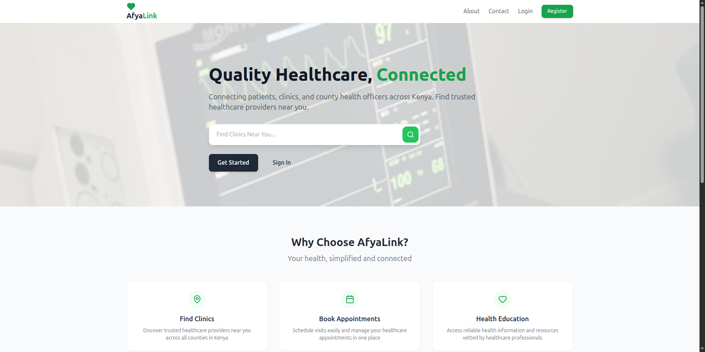
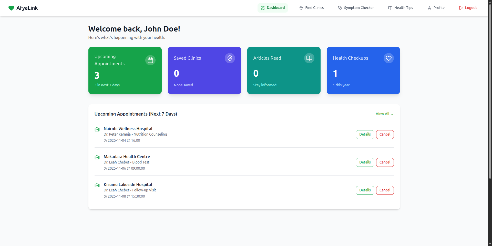
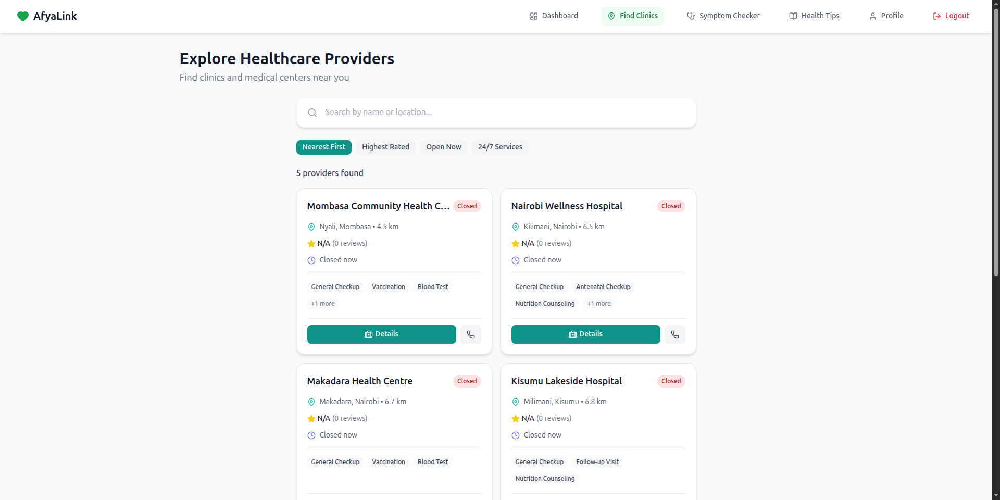
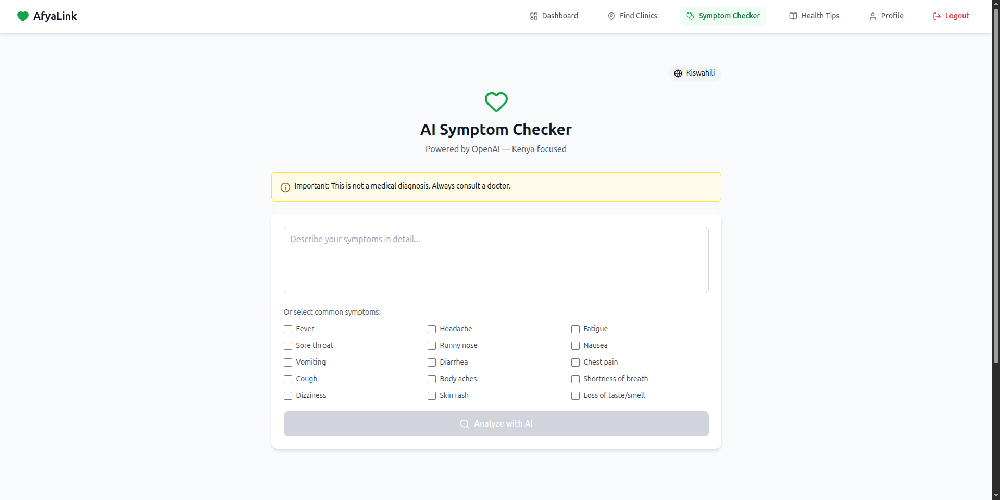
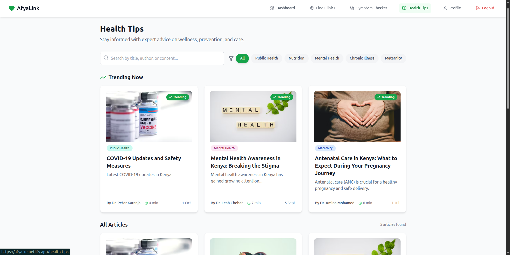
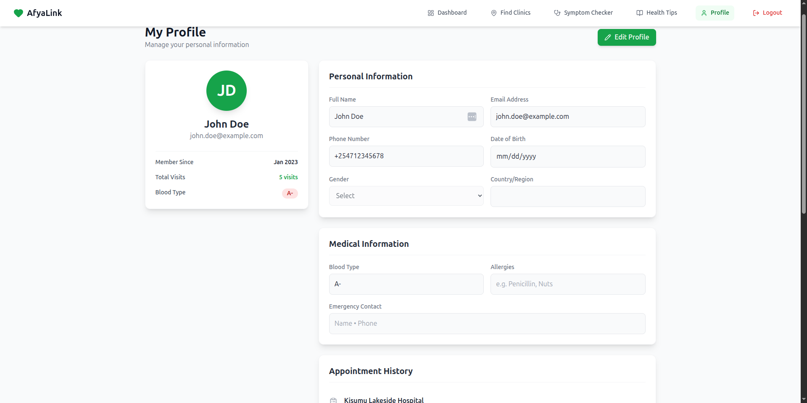

# AfyaLink KE - Full-Stack Health Management Application

#### A full-stack health management platform built with React (frontend) and Flask (backend), connecting patients, clinics, and administrators.

#### By **Benson Mwanake, Jesse Mwendwa Ndunda, Lillian Cherono**

## Description

AfyaLink KE enables patients to find nearby clinics, book appointments, check symptoms, and manage health records. Clinics can manage appointments, patients, and reports, while administrators can approve clinics, manage users, and publish health articles.

## Table of Contents

1. [Features](#features)
2. [File Structure](#file-structure)
3. [Installation](#installation)
4. [Environment Variables](#environment-variables)
5. [Usage](#usage)
6. [Deployment](#deployment)
7. [ScreenShots](#screenshots)
8. [Technologies Used](#technologies-used)
9.  [Contributing](#contributing)
10. [License](#license)
11. [Contact](#contact)

## Features

* Patient dashboard: Browse clinics, book appointments, check symptoms.
* Clinic dashboard: Manage patients, appointments, and reports.
* Admin dashboard: Approve clinics, manage users, publish health articles.
* Symptom checker integrated with OpenAI API.
* Responsive design for mobile and desktop.
* Authentication and role-based access control.

## File Structure

### Frontend (React)

```
client/
├── build/
│   ├── asset-manifest.json
│   ├── favicon.ico
│   ├── index.html
│   ├── logo192.png
│   ├── logo512.png
│   ├── manifest.json
│   ├── robots.txt
│   └── static/
│       ├── css/
│       └── js/
├── package.json
├── package-lock.json
├── postcss.config.js
├── public/
│   ├── favicon.ico
│   ├── index.html
│   ├── logo192.png
│   ├── logo512.png
│   ├── manifest.json
│   ├── _redirects
│   └── robots.txt
├── README.md
├── src/
│   ├── App.js
│   ├── components/
│   ├── context/
│   ├── features/
│   ├── hooks/
│   ├── index.css
│   ├── index.js
│   ├── pages/
│   ├── routes/
│   └── services/
└── tailwind.config.js
```

### Backend (Flask)

```
server/
├── app.py
├── config.py
├── db.json
├── extensions.py
├── migrations/
│   ├── alembic.ini
│   ├── env.py
│   ├── README
│   ├── script.py.mako
│   └── versions/
├── models.py
├── package.json
├── Procfile
├── requirements.txt
├── routes/
├── runtime.txt
├── schemas.py
├── seed.py
└── utils.py
```

## Installation

### Prerequisites

* Node.js & npm
* Python 3.10+
* Pipenv
* Modern web browser

### Frontend

```bash
cd client
npm install
npm start
```

Visit: `http://localhost:3000`

### Backend

```bash
cd server
pipenv install
pipenv shell
export FLASK_APP=app.py
flask run
```

Visit: `http://localhost:5555`

### Database Setup

```bash
flask db init
flask db migrate -m "Initial migration"
flask db upgrade
python seed.py
```

## Environment Variables

Create a `.env` file in the `client/` and `server/` directories:

```
# Frontend
REACT_APP_OPENAI_API_KEY=<your_openai_api_key>
REACT_APP_OPENAI_MODEL=gpt-4o-mini

# Backend
DATABASE_URL=<your_database_url>
SECRET_KEY=<your_secret_key>
```

## Usage

* Patients can browse clinics, book appointments, view health articles, and check symptoms.
* Clinics can manage schedules, patients, and reports.
* Admins can approve clinics, manage users, and publish articles.

## Deployment

* Frontend deployed on Netlify: [Live Site](https://afya-ke.netlify.app)
* Backend deployed on Render: [API Endpoint](https://afya-ke.onrender.com)

## ScreenShots








### Steps for Deployment

**Backend**:

1. Push to GitHub
2. Create a Render Web Service
3. Set environment variables
4. Use `pip install -r requirements.txt` during build

**Frontend**:

1. Push to GitHub
2. Deploy on Netlify or Vercel
3. Ensure build command: `npm run build` and output directory: `client/build`

## Technologies Used

**Frontend:** React, Vite, Tailwind CSS, Axios, React Router, Context API, Lucide Icons

**Backend:** Flask, Flask-RESTful, Flask-Migrate, Flask-CORS, SQLAlchemy, Marshmallow

## Contact

* Email: [benson.mwanake@student.moringaschool.com](mailto:benson.mwanake@student.moringaschool.com)
* Lillian: [lillian.cherono@student.moringaschool.com](mailto:lillian.cherono@student.moringaschool.com)
* Jesse: [jesse.mwendwa@student.moringaschool.com](mailto:jesse.mwendwa@student.moringaschool.com)
